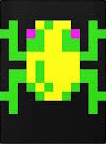
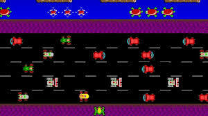

## Functional Specification

| Author       | Léna De Germain |
|--------------|-----------------|
|Created       |    9/26/2024    |
|Last Modified |    10/02/2024    |

---

 Table of content 

- [Functional Specification](#functional-specification)
- [I. Overview](#i-overview)
  - [A. What is Frogger](#a-what-is-frogger)
  - [B. How to play](#b-how-to-play)
- [II. Goals and constraints](#ii-goals-and-constraints)
  - [A. Prototypes Goals](#a-prototypes-goals)
  - [B. Final game Goals](#b-final-game-goals)
  - [C. Constraints](#c-constraints)
- [III. Requierements / Base Mechanics](#iii-requierements--base-mechanics)
  - [A. The Frog Mechanics](#a-the-frog-mechanics)
  - [B. The level](#b-the-level)
  - [C. Car Mechanics](#c-car-mechanics)
  - [D. Added Mechanics (Optional Feature)](#d-added-mechanics-optional-feature)
    - [1. Menu](#1-menu)
    - [2. Score](#2-score)
    - [3. Bonus](#3-bonus)
    - [4. Themes](#4-themes)
- [IV. Non-functional requirements](#iv-non-functional-requirements)
- [V. Deliverable](#v-deliverable)
- [VI. Glossary](#vi-glossary)

## I. Overview 

Project aims to recreate the game "Frogger" with our style using [FPGA board / Go Board](#vi-glossary) coding in [Verilog](#vi-glossary).

### A. What is Frogger

Frogger is an arcade action game developed by KONAMI and released in 1981. In the original game, the aim was to direct some frogs to their homes by dogging on a busy road. Frogs need to avoid cars to still alive and get back to their homes. 

To do this, the player must first move through the game zone, here a busy road, avoiding cars that move at different speeds. The Frog restarts at the beginning of the level if he hits a car or with a GAME OVER.

In our history, the original game was positively received as one of the greatest video games ever made. It was followed by a lot of copies and clones. It was named as "Frogger Series". For the biggest famous copies, we have a version from <u>Parker Brothers</u>, the 1982 Atari 2600, which sold 4 million copies, or in 2005, 20 million copies of various games of "Frogger" were sold.

### B. How to play

The player can control the frog using a joystick, allowing movement in all directions. In our version, the buttons on the [FPGA board](#vi-glossary) will be used to move the frog.

The game starts with the frog positioned at the bottom of the screen, and the goal is to advance to the top to complete the level. Along the way, the player must avoid various obstacles moving horizontally across the screen.

Frogger can be played solo, but it's also possible to play with two players, taking turns.

## II. Goals and constraints 

### A. Prototypes Goals

- Recreate the road (background for traditional Frogger)
- Implement a frog
- Implement car for obstacles
- systhem of level
- Implement keybindings with switchs present on the card to move with frog
- Possibility to reset the game

### B. Final game Goals 

- Add sprite's frog
- Add many car's sprite
- Add Win Page
- Add menu
   - Save game
   - Change Frog's appearance
   - Show up the level & the maximum level reached
   - Have a Register of Different Bonuses
- differents themes
   - halloween's theme
   - Christmas' theme
   - ALGOSUP's theme

### C. Constraints 

* The game board has for resolution a [VGA display](#vi-glossary) like 640x480 and it's reparted on a 20x15 grid.
* The level must be displays on the [2-digit 7-segment display](#vi-glossary) of the Go Board.
* To move the player we need to use the four buttons on [Go-board](#vi-glossary) (SW1, SW2, SW3, SW4)
* the player have only one life
* There shall be at least 8 levels in the game, when the level increases the game dificulty

## III. Requierements / Base Mechanics

|Requierements|Usefullness|
|-|-|
|Name|We have done a vote to find a name, The majority adopted "FroggyRanck"|
|Main character|A character played by player|
|Main character's design|A basic character design for a basic level, a character design for special levels, dimensions are 32x32|
|Obstacles|a character for Obstacles avoided by player|
|Obstacles' design| A basic design for a basic level, a design for special levels, the obstacle's dimensions are 32x32*(2 or 3)|
|Playground|A space without physique/collision for a play area|

### A. The Frog Mechanics

The buttons on the [FPGA board](#vi-glossary) are used to control the frog and reset the game to the beginning. The frog can only have one space at a time, after the frog hits an obstacle or finish the level, the frog returns to the bottom of the screen.

| Button | Direction |
|-|-|
| SW1 | forward |
| SW2 | backward |
| SW3 | right |
| SW4 | left | 
| SW1 & SW2 & SW3 & SW4 | reset the game |

### B. The level

The player can view their level on the [Go Board](#vi-glossary) using the [2-digit 7-segment display](#vi-glossary). If the game is reset or the frog is hit by a car, the level indicator resets to 1 (at the beginning). But if the frog reaches the top of the screen, their level increases by one. We've been asked to make the game a 20x15 grid, the screen being 640x480, and one grid corresponds to 32x32 pixels (640/20 = 32, 480/15 = 32).

### C. Car Mechanics

Mostly the obstacle is vehicles like a car and they appear from the left or the right of the screen and move horizontally on the screen. When the level increases there a more cars at different speeds to make the game more difficult. At the begining, only one car can appears on a horizontal row and the number increase for each levels passed. They can have a lot of design or the width can be changed.

### D. Added Mechanics <u>(Optional Feature)</u>

#### 1. Menu

Menu is useful to save or make a pause on game, we could also add some possibility like this :

|Menu's Possibility | button |
|-|-|
|Open Menu and Close Menu |SW1 & SW2 |
|Save Button| SW1 |
|Show up the level & Score | SW2
|Possibility to change Frog's Appearance| SW3 |
|Have a Register of Different Bonuses| SW4 |

#### 2. Score
Score able to compare two player if they want to know which one have the bigest score

|Action|number of points won|
|-|-|
|finish a level| + 100 points|
|Take a gift| + 20 points|
|Take Poison Gift | - 20 points|
|hit a obstacle | reset the score at 0 |

#### 3. Bonus

The bonus can appear randomly on the screen at frequency 5%, he can only have one bonus by level.

| Bonus | Effect |
|-|-|
|Gift|increase your score by 20 points|
|Poison Gift|reduce the score by 20 points|
|StopTime|stop the obstacle for 3 seconds|
|Level Reboot|return to start of level
|Star|make the character invincible for 3 seconds|
|Left arrow|slows down obsctacles|
|Right arrow|speed up obsctacles|

#### 4. Themes

To more diversity, we have decided to add different themes to have another game experience.

|Level|Themes|Changement|
|-|-|-|
|4 lvl|Halloween|The frog is replaced by a ghost and the obstacles become pumpkins. |
|8 lvl| Christmas|the frog become a lutin and the obstacles are replaced by reindeer|
|2 lvl|ALGOSUP| obstacles replaced by Elone and the frog become Frank |

## IV. Non-functional requirements 

To code, in particular, but also to run the game, we need to meet few requirements.

|Non-Functional Requirement|Utility| Run / Code |
|-|-|-|
|Windows/MacOS|We do all that we need on their computer's system.| Code |
|FPGA board |We program the game on this board, the Go Board from Nandland.com | Run & Code |
|Verilog|It's the language used to program the game.| Code|
|Screen with [VGA port](#vi-glossary)|To observe the result of our code, we project it on a VGA Screen. We've been asked to make the game a 20x15 grid, the screen being 640x480, and one square corresponds to 32x32 pixels (640/20 = 32, 480/15 = 32).| Run & Code |
|Cable double [VGA port](#vi-glossary)|It's cable is used to connect the FPGA board to VGA Screen| Run & Code|

## V. Deliverable

Our client, ALGOSUP, asked us to deliver documents and the final product on a precise date.

|Date|Deliverable|
|-|-|
|10/07/2024|Functional Specification Deadline|
|10/14/2024|Technical Specification Deadline|
|10/21/2024|Code Deadline |
|10/21/2024|Test Plan Deadline| 
|10/21/2024|User Manual Deadline|
|10/25/2024|Presentation|

## VI. Glossary

|Term|Definition|Source|
|-|-|-|
|FPGA Board / Go board|Field Programmable Gate Arrays (FPGAs) are integrated circuits used to program and launch games.|<a href="https://www.arm.com/glossary/fpga#:~:text=Field%20Programmable%20Gate%20Arrays%20(FPGAs,requirements%20after%20the%20manufacturing%20process.">arm</a>|
|Verilog|Verilog is a hardware description language used for computer simulation and synthesis. This is what we used to code the FPGA board.|[ScienceDirect](https://www.sciencedirect.com/topics/computer-science/verilog#:~:text=Verilog%20is%20a%20hardware%20description,language%20constructs%20for%20logic%20synthesis.)|
|VGA display / VGA Port | For “Video Graphics Array”, is a connection interface for transmitting analog video signals. It was designed by IBM and introduced in some computers and monitors in 1987.|[LCD COMPARE](https://www.lcd-compare.com/definition-de-vga.htm)|
|2-digit 7-segment display|A seven-segment display is a form of electronic display device for displaying decimal numerals that is an alternative to the more complex dot matrix displays.|[Wikipedia](https://en.wikipedia.org/wiki/Seven-segment_display)|

