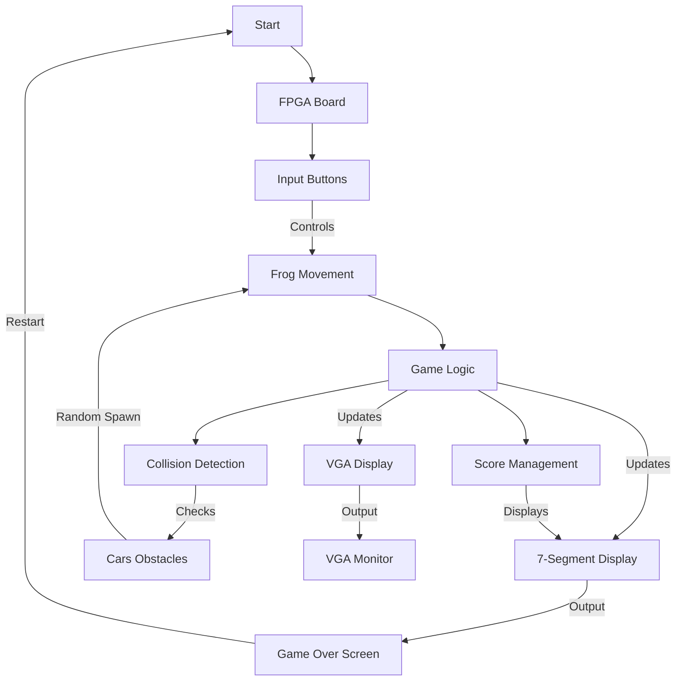

# 2023-2024 - FROGGYRANCK PROJECT - FPGA GAME - TEAM 1

## Role Distribution for the Project

| Photo | Name | Role | Contact |
|---|---|---|---|
| | Grégory PAGNOUX | Project Manager | [GitHub](https://github.com/Gregory-Pagnoux) \| [LinkedIn](https://www.linkedin.com/in/grégory-pagnoux-313b3a251/) \| [Mail](mailto:gregory.pagnoux@algosup.com) |
|  | Lena DE GERMAIN | Program Manager | [GitHub](https://github.com/lenadg18) \| [LinkedIn](https://www.linkedin.com/in/lena-degermain-5535a032a/) \| [Mail](mailto:lena.degermain@algosup.com) |
|  | Mathis LEBEL | Technical Leader | [GitHub](https://github.com/mathislebel) \| [LinkedIn](https://www.linkedin.com/in/mathis-lebel-429114293/) \| [Mail](mailto:mathis.lebel@algosup.com) |
|  | Robin GOUMY | Software Engineer | [GitHub](https://github.com/RobinGOUMY) \| [LinkedIn](https://www.linkedin.com/in/robin-goumy-66452832a/) \| [Mail](mailto:robin.goumy@algosup.com) |
|  | Alexis SANTOS | Quality Assurance | [GitHub](https://github.com/Mamoru-fr) \| [LinkedIn](https://www.linkedin.com/in/alexis-santos-83481031b/) \| [Mail](mailto:alexis.santos@algosup.com) |
|  | Yann-Maël BOUTON | Technical Writer | [GitHub](https://github.com/devnjoyer) \| [LinkedIn]() \| [Mail](mailto:yann-mael.bouton@algosup.com) |

## Technical Specifications


<details>
<summary>📖 Table of Contents</summary>

- [I. Project Introduction](#i-project-introduction)
  - [A. Client](#a-client)
  - [B. Project Objective](#b-project-objective)
  - [C. Project Architecture](#c-project-architecture)
- [II. Solution](#ii-solution)
  - [A. Description](#a-description)
  - [B. Components](#b-components)
    - [1. Frog (Player)](#1-frog-player)
    - [2. Cars (Obstacles)](#2-cars-obstacles)
    - [3. Level System](#3-level-system)
    - [4. 7-Segment Display](#4-7-segment-display)
  - [C. Display](#c-display)
  - [D. Constraints](#d-constraints)
  - [E. Risks and Assumptions](#e-risks-and-assumptions)
- [III. Technical Specifications](#iii-technical-specifications)
  - [A. Graphic Convention](#a-graphic-convention)
  - [B. Writing Convention](#b-writing-convention)
  - [C. File Architecture](#c-file-architecture)
  - [D. Implementation](#d-implementation)
  - [E. Signal Management](#e-signal-management)
  - [F. Timing and Clocks](#f-timing-and-clocks)
  - [G. Memory Management](#g-memory-management)
  - [H. Hardware Interfaces](#h-hardware-interfaces)
  - [I. Performance Metrics](#i-performance-metrics)
  - [J. Debugging and Testing](#j-debugging-and-testing)
  - [K. Documentation](#k-documentation)
  - [L. Version Control](#l-version-control)
  - [M. Risk Management](#m-risk-management)
  - [N. Future Enhancements](#n-future-enhancements)
  - [O. Security Considerations](#o-security-considerations)
  - [P. Community Engagement](#p-community-engagement)
  - [Q. Success Metrics](#q-success-metrics)
  - [R. Community Engagement](#r-community-engagement)
  - [S. Success Metrics](#s-success-metrics)

</details>


| | |
| - | - |
| Author(s) | Mathis LEBEL |
| Reviewer(s) | Alexis SANTOS |
| Created on | 10/07/2024 |
| Last updated | 10/14/2024 |


## I. Project Introduction

### A. Client
- The **FroggyRanck** project is a reimagining of the arcade game **Frogger** on an **FPGA** board.
- Developed to provide a retro gaming experience with custom features.
- Aimed at a playful and educational audience.

### B. Project Objective
- To recreate a game on FPGA where the player controls a frog that must cross a road filled with cars to reach its destination.
- Includes VGA display mechanisms and hardware controls (buttons on the board).

### C. Project Architecture



## II. Solution

- ### A. Description
  - Developed in **Verilog** on the **[FPGA board name]**.
  - Display managed via VGA, with the player using the board's buttons to move the frog.
  - Each level becomes progressively more difficult with an increase in the number of obstacles.

- ### B. Components
  - #### 1. Frog (Player)
    - Controlled using the directional buttons on the FPGA board.
    - Frog sprite displayed on the VGA screen.
  
  - #### 2. Cars (Obstacles)
    - Randomly generated cars moving horizontally.
    - Variable speed of cars to increase difficulty.
  
  - #### 3. Level System
    - Gradual increase in car speed at each level.
    - The player earns a point for each successful crossing.
  
  - #### 4. 7-Segment Display
    - Player's score displayed on the **7-segment display** of the FPGA board.

- ### C. Display
  - Game displayed on a **VGA** screen connected to the FPGA board, with a resolution of 640x480 pixels.

- ### D. Constraints**
  - Real-time operation with no noticeable latency.
  - Managing button bounces via a Verilog filter.
  - VGA display limited to 640x480 with 256 colors.

- ### E. Risks and Assumptions**
  - **Development Time**: Delivery within a tight timeline; non-essential features may be set aside for a future version.
  - **Performance Risk**: Importance of hardware management for a good user experience.
  - **Compatibility**: Game must be compatible with the specified FPGA board.

## III. Technical Specifications

- ### A. Graphic Convention**
  - **Background**: Black color (#000000).
  - **Frog**: 16x16 pixel sprite, green (#00FF00).
  - **Cars**: 16x32 pixel sprites, color varying by level.
  
  ```verilog
  // Example sprite definition for the frog
  reg [15:0] frog_sprite [0:255]; // Store 16x16 sprite data
  initial begin
      $readmemh("frog_sprite.mem", frog_sprite);
  end
## B. Writing Convention
- **Verilog conventions**:
  - **UpperCamelCase** for modules (e.g., `FrogPlayer`).
  - **snake_case** for signals (e.g., `frog_position`).
  - Comments in English, starting with a capital letter and punctuation.

## C. File Architecture
- Code organized into the following directories:
  - `src/`: Verilog source code.
    - `frog/`: Contains frog-related logic.
    - `cars/`: Contains car-related logic.
    - `display/`: Contains display logic for VGA and 7-segment display.
  - `test/`: Unit tests.
    - Each component has corresponding test files (e.g., `frog_test.v`).
  - `docs/`: Project documentation, including design and user manuals.

## D. Implementation
- **Step 1: Prototyping the Base Game**
  - Initial game logic developed with basic mechanics.
  
  ```verilog
  // Pseudocode for game state management
  always @(posedge clk) begin
      case (game_state)
          START: begin
              // Initialize game variables
          end
          PLAY: begin
              // Main game loop
              update_frog_position();
              check_collisions();
              update_score();
          end
          GAME_OVER: begin
              // Display game over screen
              display_game_over();
          end
      endcase
  end
## Step 2: Integrating Components
- **Frog Controller**: Handles input and updates position.
- **Car Controller**: Generates cars with random speeds.

```verilog
// Example of frog position update based on input
always @(posedge clk) begin
    if (btn_up) frog_position <= frog_position - 1;
    if (btn_down) frog_position <= frog_position + 1;
    if (btn_left) frog_position <= frog_position - 1;
    if (btn_right) frog_position <= frog_position + 1;
end
```
## Step 3: Testing and Debugging

- Continuous integration and regular debugging sessions.
- Utilize simulation tools for hardware behavior visualization.

## E. Signal Management
Effective signal management is critical for ensuring proper communication and synchronization between various components in the **FroggyRanck** project. This section outlines the strategies for input and output signal management, including debouncing techniques, synchronization, and signal processing.

## F. Input Signals:
- Button inputs debounced to prevent incorrect readings.

```verilog
// Debouncing logic
always @(posedge clk) begin
    if (button_input) begin
        debounce_counter <= debounce_counter + 1;
    end else begin
        debounce_counter <= 0;
    end
end
```
## G. Output Signals
- VGA signals synchronized for smooth graphics rendering.
- 7-segment display outputs updated according to game score.

```verilog
// Example of updating the 7-segment display
always @(posedge clk) begin
    seven_segment_display <= score; // Assuming score fits in 7 segments
end
```
## H. Timing and Clocks
- Utilizing a 50 MHz clock with derived 25 MHz clock for VGA.
- Timing constraints ensuring game logic and rendering operate without latency.

## I. Memory Management
- Efficient memory allocation for sprites and dynamic data:

```verilog
// Example of sprite allocation
reg [15:0] sprite_memory [0:NUM_SPRITES-1];
initial begin
    $readmemh("sprites.mem", sprite_memory);
end
 ```
 ## J. Hardware Interfaces
- Defined interfaces for communication between components.
- Specific FPGA pins assigned for buttons, VGA output, and 7-segment display.

## K. Performance Metrics
- **Frame Rate**: Targeting 60 frames per second.
- **Input Response Time**: Processing inputs within 10 ms.

## L. Debugging and Testing
- Structured testing approach with unit and integration tests.
- Automated testing suite developed for efficiency.

## M. Documentation
- Inline comments within the code for clarity.
- High-level documentation explaining architecture and design decisions.

## N. Version Control
- Use of Git for collaborative development.
- Branching strategies for managing features and fixes.

## O. Risk Management
- Identified risks with mitigation strategies:
  - Prioritization of essential features.
  - Regular performance testing.
  - Schedule buffer for unexpected delays.

## P. Future Enhancements
- Plans for additional levels and challenges.
- Potential implementation of high score features.
- Exploration of networked multiplayer capabilities.

## Q. Security Considerations
- Measures in place to protect user data if collected.
- Prevent unauthorized access to FPGA and game data.

## R. Community Engagement
- Collect user feedback through surveys.
- Host forums for player suggestions and experiences.
- Plan beta testing sessions to refine game mechanics.

## S. Success Metrics
- Evaluating success based on user satisfaction and engagement.
- Monitoring performance metrics to ensure targets are met.
- Tracking gameplay statistics for ongoing improvement.

## Success Evaluation
- Success measured by:
  - User feedback after deployment.
  - Adherence to deadlines and performance objectives.
  - Reduction of bugs detected during testing.
  - Achievement of target frame rates and input response times.

## Glossary

| Term                       | Definition                                                                                                           | Link                                                                                      |
|----------------------------|----------------------------------------------------------------------------------------------------------------------|-------------------------------------------------------------------------------------------|
| **Automated Testing**      | A software testing technique that uses specialized tools to execute tests and compare actual outcomes with expected results. | [Learn More](https://en.wikipedia.org/wiki/Test_automation)            |
| **Community Engagement**    | The process of involving individuals and groups in the development and improvement of a project or service.         | [Learn More](https://en.wikipedia.org/wiki/Community_engagement)             |
| **Clock**                  | A timing device used in digital circuits to coordinate the timing of various components.                            | [Learn More](https://en.wikipedia.org/wiki/Clock_signal)                                 |
| **Debugging**              | The process of identifying and removing errors from computer hardware or software.                                  | [Learn More](https://en.wikipedia.org/wiki/Debugging)          |                              |                                 |
| **Frame Rate**             | The frequency at which consecutive images appear on a display; measured in frames per second (fps).                | [Learn More](https://en.wikipedia.org/wiki/Frame_rate)                   |
| **Hardware Interfaces**    | Physical connections that allow different hardware components to communicate with each other.                      | [Learn More](https://en.wikipedia.org/wiki/Hardware_interface_design)            |
| **Memory Management**      | The process of controlling and coordinating computer memory, particularly the allocation and deallocation of memory blocks. | [Learn More](https://en.wikipedia.org/wiki/Memory_management)                           |
| **Version Control**        | A system that records changes to files or sets of files over time so that specific versions can be recalled later.  | [Learn More](https://fr.wikipedia.org/wiki/Gestion_de_versions)     |

